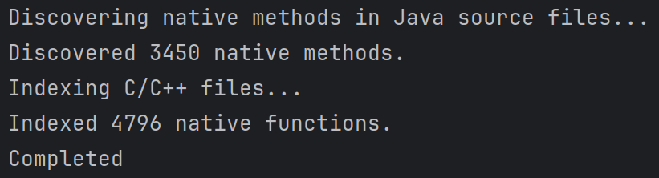

# java-native-methods-mapper

Native functions are stored under: native_functions.json

Native methods are stored under: native_methods.json
 
# java-native-methods-mapper

GradientBoostingClassifier

LogisticRegression

Random Forest Classifier

Neural Network

Generated Call Graph with naive ansatz

Generated Call Graph with v3!

Jdk 22 Analysis

